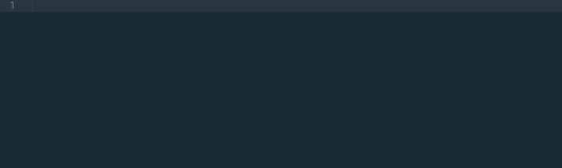
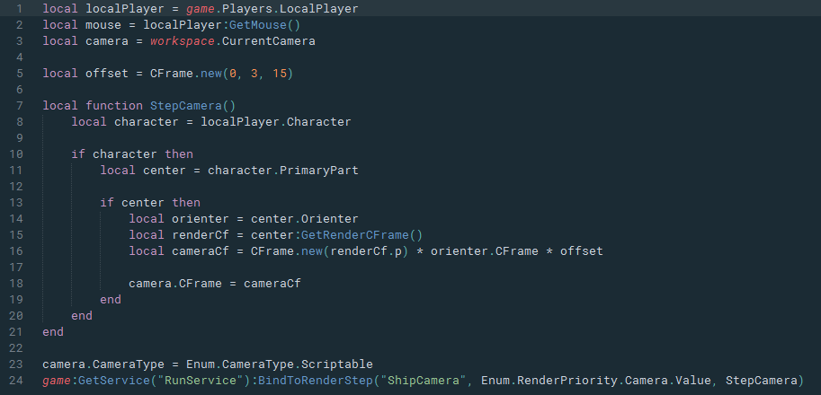

# RBXLua for Sublime Text

This plugin adds support for [ROBLOX](https://roblox.com) Lua to Sublime Text 3. Currently it supports syntax highlighting, indentation, snippets, and an extremely comprehensive set of completions automatically generated from the API dump.

You will need Sublime Text 3 build 3084 or later to use syntax highlighting, which depends on the new `sublime-syntax` format. The earliest stable build with this support is build 3103.

Once installed, simply select the language using `Ctrl-Shift-P` and searching for `Set Syntax: ROBLOX Lua`, or open a `.lua` or `.rbxs` file. The language definition will by automatically applied to `.lua` and `.rbxs` file extensions. If it isn't applied to `.lua`, you may need to disable the default Lua package by adding its name to the `ignored_packages` array, so it looks like this:

```json
{
	"ignored_packages":
	[
		"Vintage",
		"Lua"
	]
}
```

## Installation
Currently this plugin is not on Package Control; keep an eye on [this PR](https://github.com/wbond/package_control_channel/pull/5781) to find out when it is. In the meantime, to manually install it:

1. Download the repository's source from [the latest release](https://github.com/MemoryPenguin/RBXLua-SublimeText/releases/latest).
2. Open Sublime Text.
3. Open your packages folder using Preferences>Browse Packages in the menu.
4. Create a new folder in your packages folder; name it something descriptive (I suggest `RbxLua`)
5. Extract the contents of the repository download into the folder you made.
6. Restart Sublime Text 3.
7. ???
8. Profit

## Images
*Images were captured using the [Boxy Ocean](https://packagecontrol.io/packages/Boxy%20Theme) theme and syntax highlighting.*


