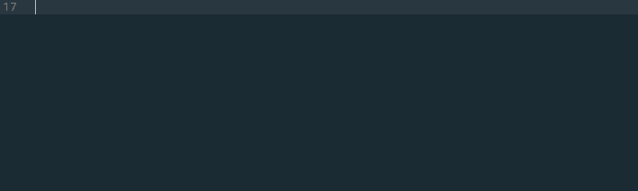

# RBXLua for Sublime Text

This plugin adds support for [ROBLOX](https://roblox.com) Lua to Sublime Text 3. Currently it supports syntax highlighting, indentation, snippets, and an extremely comprehensive set of completions automatically generated from the API dump.

You will need Sublime Text 3 build 3084 or later to use syntax highlighting, which depends on the new `sublime-syntax` format. The earliest stable build with this support is build 3103.

Once installed, simply select the language using `Ctrl-Shift-P` and searching for `Set Syntax: ROBLOX Lua`, or open a `.lua` or `.rbxs` file. The language definition will by automatically applied to `.lua` and `.rbxs` file extensions. If it isn't applied to `.lua`, you may need to disable the default Lua package by adding its name to the `ignored_packages` array, so it looks like this:

```json
{
	"ignored_packages":
	[
		"Vintage",
		"Lua"
	]
}
```

## Installation

### Package Control
The easiest way to install the plugin is through [Package Control](https://packagecontrol.io/).

1. Open Sublime Text.
2. [Install Package Control](https://packagecontrol.io/installation) if it isn't already installed.
3. Press `Ctrl-Shift-P` to open the command palette.
4. Search for `Package Control - Install Package`.
5. Search for `ROBLOXLua` in the list.
6. Press enter with the `ROBLOXLua` entry selected.
7. ???
8. Profit

### Manual
In case you can't use Package Control, you can install the plugin manually. Note that you will have to manually update each time a new update is released.

1. Download the repository's source from [the latest release](https://github.com/MemoryPenguin/RBXLua-SublimeText/releases/latest).
2. Open Sublime Text.
3. Open your packages folder using Preferences>Browse Packages in the menu.
4. Create a new folder in your packages folder named ROBLOXLua (it must be named ROBLOXLua or autocomplete will not work!)
5. Extract the contents of the repository download into the folder you made.
6. Restart Sublime Text 3.
7. ???
8. Profit

## Images
*Images were captured using the [Boxy Ocean](https://packagecontrol.io/packages/Boxy%20Theme) theme and syntax highlighting.*



